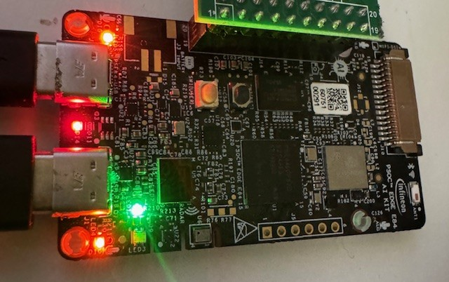

# NanoGraph_PSOC_E84

Demonstration of NanoGraph on Cortex-M55/M33 (PSOC_E84) : based on the "PSOC_Edge_Sensor_Hub_IMU" program, a cascade of filter and detector triggers the LED of the board when a vibration occurs.

